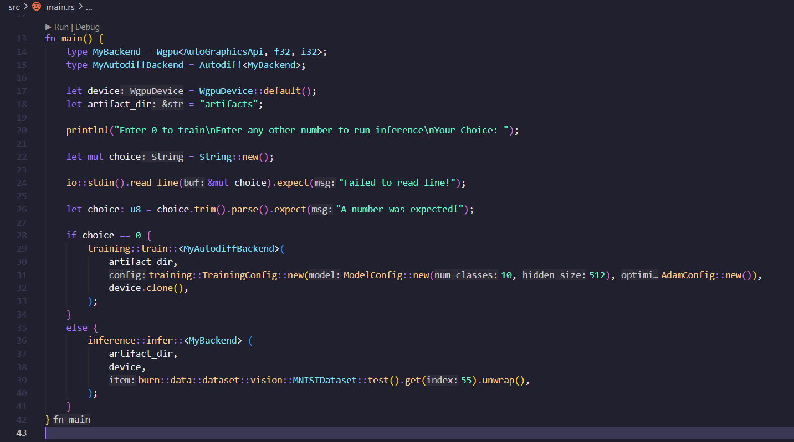

# LFX Mentorship 2024 Mar-May Pre-Test
**This is a [pre-test](https://github.com/WasmEdge/WasmEdge/discussions/3182) for the project: [LFX Mentorship (Mar-May, 2024): Integrate burn.rs as a new WASI-NN backend](https://github.com/WasmEdge/WasmEdge/issues/3172)**

## Table of Contents


___

# Task 1
>1. Framework Execution: Applicants must demonstrate proficiency in building and executing backend frameworks. This involves working with frameworks such as:
>
>      - mlx
>      - whisper.cpp
>      - intel-extension-for-transformers
>      - burn
>
>    You are required to share screenshots and a brief documentation detailing your build and execution process for examples from these frameworks. You can pick any example to demonstrate the execution.

**For this task i have chosen to work with the [burn](https://github.com/tracel-ai/burn) framework.**

**Example Chosen:** Follow along of [guide](https://burn.dev/book/basic-workflow/index.html) from [The Burn Book](https://burn.dev/book/overview.html) (___Training a simple CNN on the MNIST dataset and running inference___)

## 1. Setup: 
Created a project [burnbook_guide](./burnbook_guide) and added dependencies.

```
cargo new burnbook_guide
cd burnbook_guide

cargo add burn --features wgpu
cargo add burn --features train
```


Also run: 
```
cargo add burn --features vision
cargo add indicatif
```
These are added because i faced some errors during execution.

Now the [Cargo.toml](./burnbook_guide/Cargo.toml) file should look like this: 


Build the project: 
```
cargo build
```


## 2. Coding:
Code is written by doing a follow along of the [guide](https://burn.dev/book/basic-workflow/index.html) and also referring to this example's [github](https://github.com/tracel-ai/burn/tree/main/examples/guide) for the complete and updated code. 

## 3. Training:
Run the [main.rs](./burnbook_guide/src/main.rs) with choice 0 to start the training.



Burn displays a training dashboard in the CLI


## 4. Inference: 
Run the [main.rs](./burnbook_guide/src/main.rs) with any input choice other than 0 to ge the inference for the image at the 55th index in the MNIST test set (hardcoded in the main function).


## Conclusion: 
**Successfully executed the follow along MNIST example from the Burn Book using the Burn framework**

# Task 2
>3. For Proposal [LFX Mentorship (Mar-May, 2024): Integrate burn.rs as a new WASI-NN backend #3172](https://github.com/WasmEdge/WasmEdge/issues/3172):
>   
>      - Follow [this guide](https://wasmedge.org/docs/contribute/source/plugin/rusttls/) to build and execute the `rustls` plugin.
>      - Please choose any example to run the `rustls` plugin on your device, then share screenshots and a summary of your build process and execution results.
