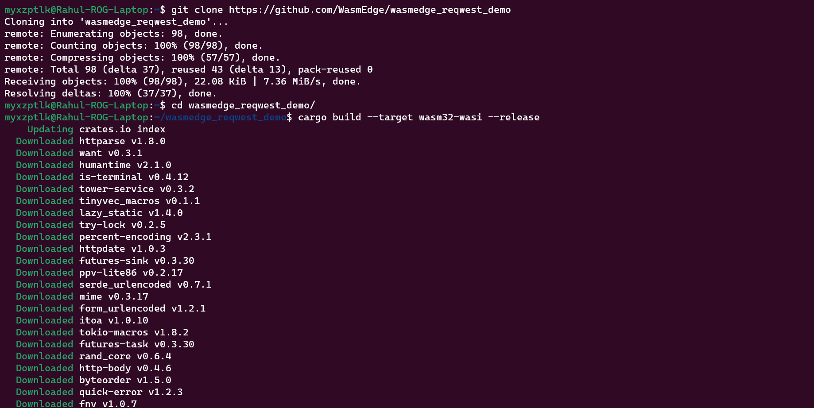

# LFX Mentorship 2024 Mar-May Pre-Test
**This is a [pre-test](https://github.com/WasmEdge/WasmEdge/discussions/3182) for the project: [LFX Mentorship (Mar-May, 2024): Integrate burn.rs as a new WASI-NN backend](https://github.com/WasmEdge/WasmEdge/issues/3172)**

## Table of Contents
### 1. [Task 1](/README.md#task-1)
   - [Setup](README.md#1-setup)
   - [Coding](README.md#2-coding)
   - [Training](README.md#3-training)
   - [Inference](README.md#4-inference)
   - [Conclusion](README.md#conclusion)

### 2. [Task 3](/README.md#task-3)
   - [Install WasmEdge](README.md#1-install-wasmedge)
   - [Build WasmEdge Rustls plug-in](README.md#2-build-wasmedge-rustls-plug-in)
   - [WasmEdge reqwest API example](README.md#3-wasmedge-reqwest-api-example)
   - [WasmEdge hyper API example](README.md#4-wasmedge-hyper-api-example)
   - [Conclusion](README.md#conclusion-1)

___

# Task 1
>1. Framework Execution: Applicants must demonstrate proficiency in building and executing backend frameworks. This involves working with frameworks such as:
>
>      - mlx
>      - whisper.cpp
>      - intel-extension-for-transformers
>      - burn
>
>    You are required to share screenshots and a brief documentation detailing your build and execution process for examples from these frameworks. You can pick any example to demonstrate the execution.

**For this task I have chosen to work with the [burn](https://github.com/tracel-ai/burn) framework.**

**Examples Chosen:** Follow along of [guide](https://burn.dev/book/basic-workflow/index.html) from [The Burn Book](https://burn.dev/book/overview.html) using **wgpu** backend ( ___Training a simple CNN on the MNIST dataset and running inference___ )

## 1. Setup: 
Created a project [burnbook_guide](./burnbook_guide) and added dependencies.

```
cargo new burnbook_guide
cd burnbook_guide

# Using wgpu backend
cargo add burn --features wgpu 
cargo add burn --features train
```


Also run: 
```
cargo add burn --features vision
cargo add indicatif
```
These are added because I faced some errors during execution.

Now the [Cargo.toml](./burnbook_guide/Cargo.toml) file should look like this: 


Build the project: 
```
cargo build
```


## 2. Coding:
Code is written by doing a follow along of the [guide](https://burn.dev/book/basic-workflow/index.html) and also referring to this example's [github](https://github.com/tracel-ai/burn/tree/main/examples/guide) for the complete and updated code. 

## 3. Training:
Run the [main.rs](./burnbook_guide/src/main.rs) with choice 0 to start the training.


Burn displays a training dashboard in the CLI


The model weights are stored in the [artifacts](/burnbook_guide/artifacts) folder and are later used for model inference.

## 4. Inference: 
Run the [main.rs](./burnbook_guide/src/main.rs) with any input choice other than 0 to ge the inference for the image at the 55th index in the MNIST test set ( hardcoded in the main function ).


## Conclusion: 
**Successfully executed the follow along MNIST example from the Burn Book using the Burn framework.**
___

# Task 3
>3. For Proposal [LFX Mentorship (Mar-May, 2024): Integrate burn.rs as a new WASI-NN backend #3172](https://github.com/WasmEdge/WasmEdge/issues/3172):
>   
>      - Follow [this guide](https://wasmedge.org/docs/contribute/source/plugin/rusttls/) to build and execute the `rustls` plugin.
>      - Please choose any example to run the `rustls` plugin on your device, then share screenshots and a summary of your build process and execution results.

**Examples Chosen:** [wasmedge_reqwest_demo](https://github.com/WasmEdge/wasmedge_reqwest_demo) and [wasmedge_hyper_demo](https://github.com/WasmEdge/wasmedge_hyper_demo)

## 1. Install WasmEdge: 
Install WasmEdge for current user by running the commands shown in the [installation guide](https://wasmedge.org/docs/start/install/)
```
curl -sSf https://raw.githubusercontent.com/WasmEdge/WasmEdge/master/utils/install.sh | bash
source $HOME/.wasmedge/env
```


## 2. Build WasmEdge Rustls plug-in:
**Prerequisite:** CMake: Minimum version 3.12. Install it from the [official website](https://cmake.org/download/).

Clone the WasmEdge repository. I have cloned the branch `hydai/0.13.5_ggml_lts` as specified in the pre-test details.
```
git clone -b hydai/0.13.5_ggml_lts --single-branch https://github.com/WasmEdge/WasmEdge.git
```


Next cd into the `WasmEdge/plugins/wasmedge_rustls` directory and build the rust project in release mode.
```
cd WasmEdge/plugins/wasmedge_rustls
cargo build --release
```


A `libwasmedge_rustls.so` system object file has been created in the `target/release` directory as seen below.
Copy this `libwasmedge_rustls.so` to `~/.wasmedge/plugin` to install the rustls plug-in. We do this because of the behaviour of the command to [install WasmEdge with plug-ins](https://wasmedge.org/docs/start/install/#install-wasmedge-with-plug-ins).

>The installer downloads the plug-in files from the WasmEdge release on GitHub, unzips them, and then copies them over to the `~/.wasmedge/plugin/` folder (for user install) and to the `/usr/local/lib/wasmedge/` folder (for system install).


Now we are ready to run the examples. **To show the use of the rustls plug-in I have only run the HTTPS examples.**

Add the `wasm32-wasi` as a compilation target for rust.
```
rustup add --target wasm32-wasi
```


## 3. WasmEdge reqwest API example:
To run this example clone the [wasmedge_reqwest_demo](https://github.com/WasmEdge/wasmedge_reqwest_demo) repository and build it with the wasm compilation target.
```
git clone https://github.com/WasmEdge/wasmedge_reqwest_demo
cd wasmedge_reqwest_demo/
cargo build --target wasm32-wasi --release
```



Compile the `https.wasm` file.
```
wasmedge compile target/wasm32-wasi/release/https.wasm https.wasm
```


Run the example.
```
wasmedge https.wasm
```


We get a reponse from the HTTPS secured website.

## 4. WasmEdge hyper API example: 
To run this example clone the [wasmedge_hyper_demo](https://github.com/WasmEdge/wasmedge_hyper_demo) repository and build the client-https project with the wasm compilation target.
```
git clone https://github.com/WasmEdge/wasmedge_hyper_demo
cd wasmedge_hyper_demo/client-https
cargo build --target wasm32-wasi --release
```


Compile the `wasmedge_hyper_client_https.wasm` file.
```
wasmedge compile target/wasm32-wasi/release/wasmedge_hyper_client_https.wasm wasmedge_hyper_client_https.wasm
```


Run the example.
```
wasmedge wasmedge_hyper_client_https.wasm
```


We get a reponse from the HTTPS secured website.

## Conclusion: 
**Successfully executed the WasmEdge reqwest API example and the WasmEdge hyper API example with the rustls plug-in.**
